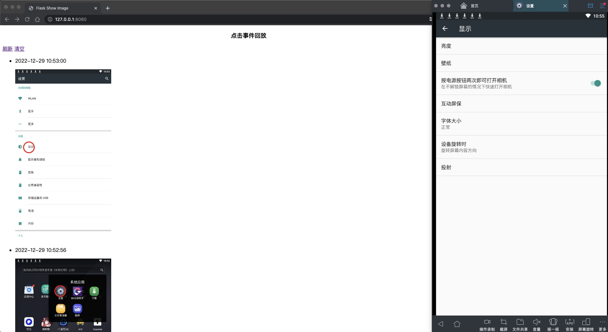

## 实现方案
1. adb getevents：监听屏幕点击事件
2. adb screencap：截图
3. opencv 画出屏幕点击的位置

## 使用说明
1. 拉取代码，安装requirements.txt依赖
2. 连接移动端设备/使用模拟器，命令行输入adb devices需存在设备
3. 执行main.py文件——用于监听设备屏幕点击事件
4. 执行app.py文件——用于启动网页服务，根据时间倒序展示屏幕截图列表

## flask页面说明
1. 屏幕截图根据时间倒序展示
2. 长按图片可放大
3. 可点击刷新按钮，展示最新的屏幕截图列表
4. 可点击清空按钮，清空所有屏幕截图内容（删除源文件）

